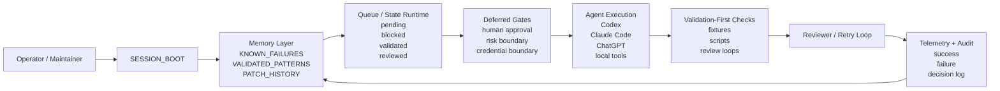
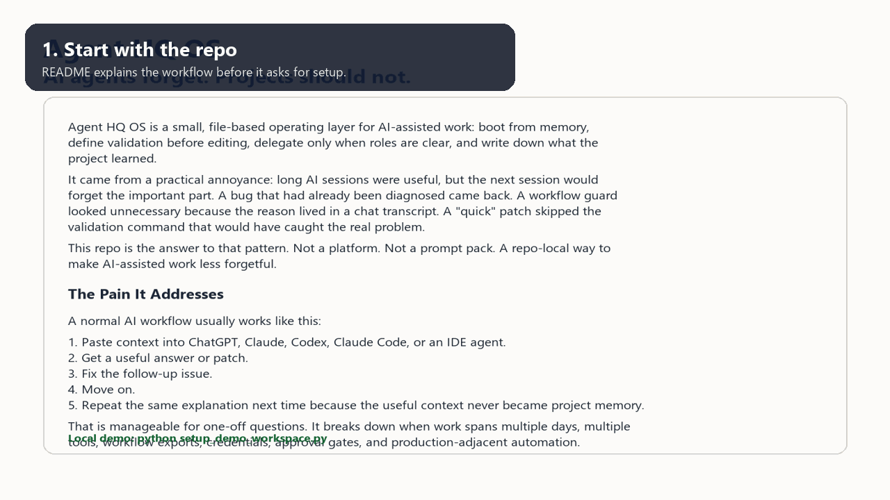
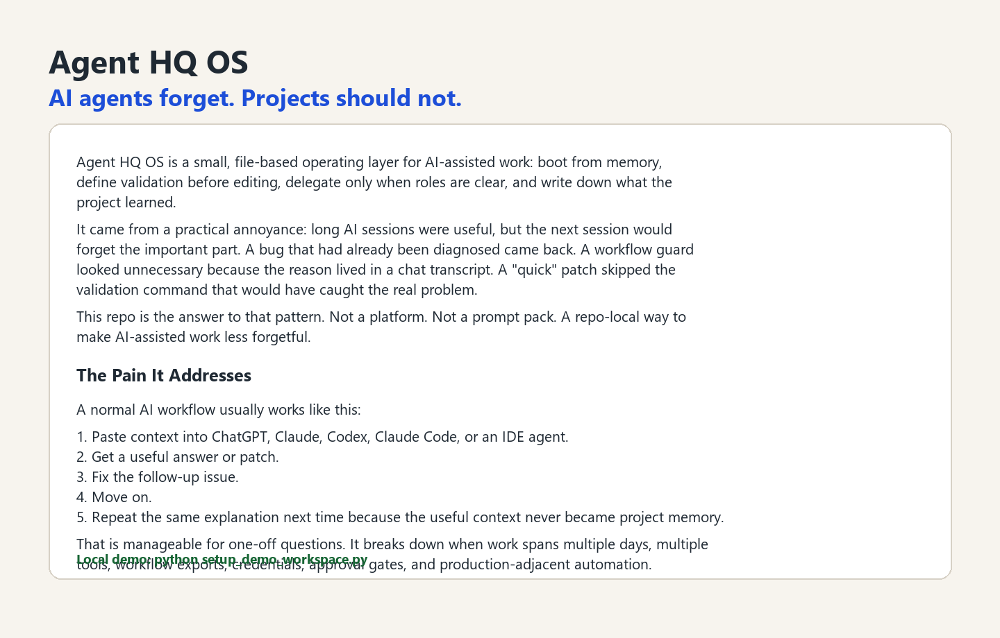
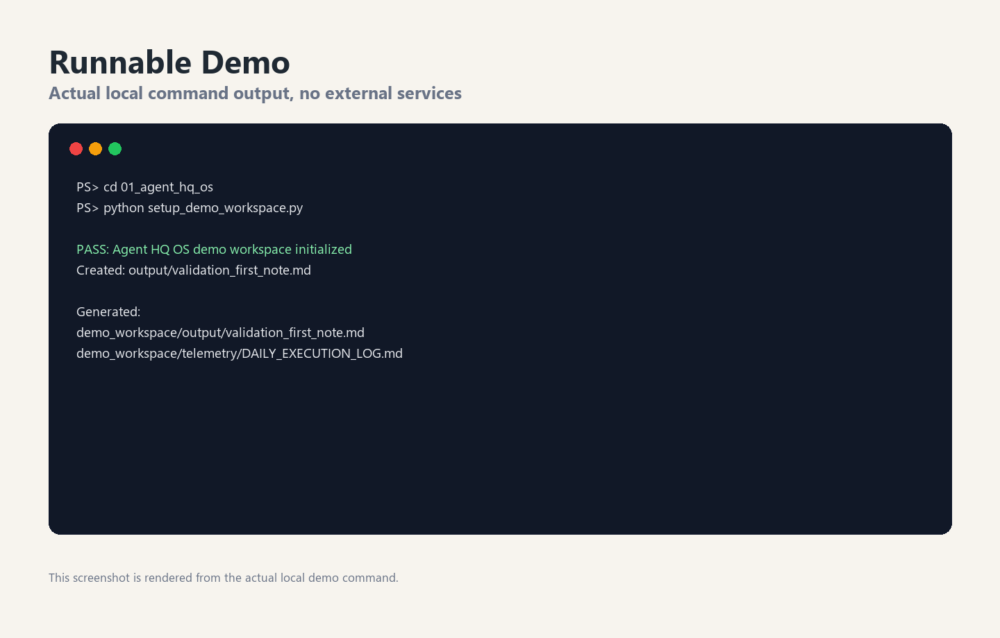
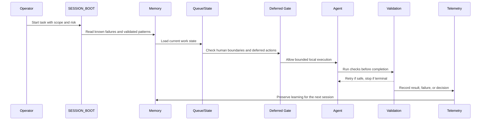
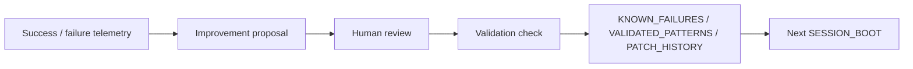

# Agent HQ OS

> Continuation-first runtime scaffolding for AI-assisted operations, validation-first execution, and safe bounded autonomy.

Agent HQ OS is a local, file-based operating scaffold for teams and maintainers who use AI agents for real work but do not want stateless prompting, invisible context drift, or unsafe automation shortcuts.

It is not a hosted platform, not a prompt collection, and not an autonomous production deployment system. It is a public OSS scaffold for building agent-assisted runtime discipline: persistent context, explicit validation gates, reviewer loops, deferred decisions, telemetry, and human boundaries.

## Badges

Status placeholders for public portfolio presentation:

| Signal | Placeholder |
| --- | --- |
| CI | `Public Repo Validation: passing` |
| Release | `v0.1.6` |
| Safety | `offline-first / no live credentials` |
| Scope | `runtime orchestration scaffold` |
| License | `MIT` |

## Why This Exists

Long AI-assisted sessions usually fail in boring but expensive ways:

- the next session forgets the prior failure;
- an agent retries a terminal error as if it were a timeout;
- validation happens after the model is already confident;
- a queue or workflow continues after the human decision point has been reached;
- production-adjacent automation quietly accumulates credentials, state, and risk;
- useful context stays trapped in chat history instead of becoming project memory.

Agent HQ OS turns those operational lessons into a repo-local runtime pattern.

## Architecture Overview



The system is intentionally simple: Markdown files, templates, validation scripts, demos, and conventions that can live beside an existing codebase.

## Feature Grid

| Capability | What it does | Why it matters |
| --- | --- | --- |
| Continuation-first execution | Starts each session from project memory instead of cold prompting | Reduces repeated context loss across long-running work |
| Validation-first governance | Defines validation before edits are treated as complete | Prevents confident but unverified changes |
| Deferred gates | Holds risky actions until a human or reviewer boundary is satisfied | Keeps publishing, credentials, trading, infra, and messaging bounded |
| Safe bounded autonomy | Lets agents work inside explicit scope and stop conditions | Avoids pretending that local automation is production autonomy |
| Queue/state scaffolds | Models work as pending, blocked, validating, reviewed, or completed | Makes multi-step automation easier to inspect |
| Reviewer/retry loops | Separates retryable failures from terminal failures | Avoids loops that keep pushing a broken state |
| Telemetry/audit layer | Captures success, failure, decision, and follow-up notes | Makes the next session smarter without hidden state |
| Self-Improving Skill | Converts telemetry into review-gated improvement proposals | Lets the operating playbook improve without unsafe self-modification |
| tmux persistence pattern | Documents persistent terminal/session handoff conventions | Useful for long-running local agents and resumable work |
| Telegram ops console design | Describes approval-first operator console patterns | Useful for preview, approval, rejection, and debug separation |
| inactive n8n orchestration drafts | Keeps workflow ideas documented but non-live | Prevents public OSS from implying active production automation |
| Offline validation | Uses fixtures, demos, and local scripts | Keeps examples reproducible without secrets |

## Repository Map

```text
.
|-- AGENTS.md                  # local agent behavior contract
|-- CLAUDE.md                  # Claude / Claude Code usage template
|-- SESSION_BOOT.md            # boot checklist for continuation-first sessions
|-- memory/                    # known failures, validated patterns, patch history
|-- telemetry/                 # execution logs and success/failure telemetry templates
|-- templates/                 # task, failure, decision, retrospective, boot templates
|-- skills/                    # review-gated operating skills
|-- starter_kit/               # copyable project bootstrap structure
|-- demo_workspace/            # local-only runnable demo
|-- validation/                # public validation script
|-- workflows/                 # standard execution loop documentation
|-- docs/                      # deeper positioning, migration, and design notes
|-- assets/rendered/           # public screenshots and walkthrough GIF
|-- visuals/                   # showcase video assets, subtitles, and render reports
`-- .github/workflows/         # public repo validation workflow
```

## Demo

Run the local demo:

```bash
git clone https://github.com/ziemaziema-center/agent-hq-os.git
cd agent-hq-os
python setup_demo_workspace.py
python validation/validate_repo.py
```

Expected result:

```text
PASS: Agent HQ OS demo workspace initialized
PASS: repo validation passed
```

The demo creates a small workspace, writes a validation-first note, and appends local telemetry. It does not call external APIs, send messages, publish content, trade, or deploy infrastructure.

### Cinematic Showcase


- [Full 60-second narrated MP4 showcase](visuals/agent_hq_os_showcase.mp4)
- [Voiceover subtitle file](visuals/voiceover_script.srt)
- [Render report](visuals/render_report.md)

### Agent Demonstration

This grant-cut demo uses generated source clips plus deterministic FFmpeg assembly to show the workflow as an actual project run: a task lands, HQ assigns agents, reviewers debate the plan, memory opens first, the build proceeds, safety gates stop risky actions, Telegram keeps the operator in control, and telemetry closes the loop.


- [Full 88-second narrated grant-cut demonstration](visuals/agent_hq_os_grant_cut_v3.mp4)
- [English subtitle file](visuals/agent_hq_os_grant_cut_v3.srt)
- [Korean subtitle file](visuals/agent_hq_os_grant_cut_v3_ko.srt)
- [Render report](visuals/agent_hq_os_grant_cut_v3_render_report.md)
- [Thumbnail](visuals/agent_hq_os_grant_cut_v3_thumbnail.png)
- [Runway source prompt pack](visuals/runway_v3_prompt_pack.md)
- [Shot manifest](visuals/runway_v3_shot_manifest.json)

Note: the cinematic source clips were generated with web UI tooling and may include provider watermarking. Exact product text, safety claims, subtitles, and render timing are produced locally by the deterministic FFmpeg pipeline.







## How It Works



The core rule is straightforward: an AI agent can assist execution, but the project must keep its own memory, validation, and stop conditions.

## Safety Model

Agent HQ OS is designed for public, offline-first, human-reviewed use.

| Boundary | Public repo behavior |
| --- | --- |
| Credentials | `.env.example` placeholders only; no live values |
| External writes | treated as approval-gated |
| Telegram / social operations | documented as ops console patterns, not active publishing |
| n8n workflows | inactive orchestration drafts and sanitized examples only |
| Crypto / trading references | offline/read-only/research framing only |
| Production deployment | not autonomous; must remain human-reviewed |
| Long-running sessions | tmux persistence is a pattern, not a hosted execution claim |
| Review loops | retry only when failure classification says retry is safe |

This project intentionally avoids claiming fully autonomous production operation. Safe autonomy requires bounded scope, evidence, and review.

## Validation Model

Validation is not an afterthought. A task is incomplete until its validation path is recorded.

Minimum validation path:

1. Read `AGENTS.md`, `SESSION_BOOT.md`, and `memory/`.
2. State risk boundaries before editing.
3. Run the narrowest useful local validation.
4. Separate retryable failures from terminal failures.
5. Record success or failure telemetry.
6. Add durable learnings back to memory.

Local checks:

```bash
python validation/validate_repo.py
python setup_demo_workspace.py
```

## Self-Improving Skill

Agent HQ OS includes a small `Self-Improving Skill` for turning real execution telemetry into safer operating rules.

This is not autonomous self-modification. The skill reads success/failure telemetry, drafts a bounded improvement proposal, identifies the validation path, and requires human review before any memory or playbook changes are promoted.



Start here:

- [Self-Improving Skill](skills/self_improving_skill/README.md)
- [Skill loop documentation](docs/SELF_IMPROVING_SKILL_LOOP.md)
- [Improvement proposal template](templates/SKILL_IMPROVEMENT_PROPOSAL.md)

## Use Cases

- OSS maintainers who want AI help without losing operational memory.
- Solo developers who move between ChatGPT, Claude, Claude Code, Codex, and local scripts.
- Small engineering teams that need reviewable agent workflows.
- Automation builders designing approval-first Telegram or n8n operations.
- AI runtime researchers exploring continuation, queues, deferred gates, telemetry, and reviewer loops.
- Safety-conscious teams documenting why some actions must remain manual.

## What Is Ready

- Public templates for continuation-first sessions.
- Starter kit for new projects.
- Local demo workspace.
- Validation script and GitHub Actions workflow.
- Memory and telemetry templates.
- Rendered screenshots and walkthrough GIF.
- Related public repositories for playbooks, model routing, automation safety, and application packaging.

## What Is Not Claimed

- No live credentials.
- No autonomous production deployment.
- No hidden hosted runtime.
- No live Telegram publishing.
- No live n8n workflow execution.
- No live trading.
- No guarantee that an AI agent can replace human review.

## Roadmap

| Milestone | Direction |
| --- | --- |
| `v0.1.x` | Improve starter kit, README badges, issue templates, examples, public demo assets, and review-gated skill loops |
| `v0.2.x` | Add richer queue/state fixtures and reviewer-loop examples |
| `v0.3.x` | Add tmux persistence cookbook and terminal recording demo |
| `v0.4.x` | Add optional local dashboard for telemetry review |
| `v0.5.x` | Add cross-repo ecosystem validation and release checklist automation |

## Grant / Application Positioning

Agent HQ OS is the flagship repo in a public AgentOpsFoundry-style portfolio for practical AI runtime operations. The grant/application case is not that this is a mature high-star project. The case is that it is a newly public, safety-conscious OSS ecosystem around a real operational problem:

> AI agents are increasingly used for complex work, but the surrounding runtime discipline is still weak. Continuation, validation, deferred gates, reviewer loops, and telemetry need to be first-class project artifacts.

Claude Code and related coding agents are most useful when projects give them durable memory, executable boundaries, and validation loops. This repo is intended to make that discipline visible, reusable, and reviewable.

## Related Public Repositories

- [agent-hq-os](https://github.com/ziemaziema-center/agent-hq-os) - flagship continuation-first runtime scaffold.
- [shared-agent-playbooks](https://github.com/ziemaziema-center/shared-agent-playbooks) - reusable agent roles and review protocols.
- [claude-code-openrouter-workbench](https://github.com/ziemaziema-center/claude-code-openrouter-workbench) - local model-routing workbench for Claude Code, OpenRouter, LiteLLM, Ollama, and DeepSeek-style workflows.
- [n8n-sns-automation-framework](https://github.com/ziemaziema-center/n8n-sns-automation-framework) - approval-first SNS automation framework with sanitized workflow examples.
- [spontaneous-flight-deals-engine](https://github.com/ziemaziema-center/spontaneous-flight-deals-engine) - scoring and alerting engine for Korea-origin flight deals.
- [upbit-safe-automation-lab](https://github.com/ziemaziema-center/upbit-safe-automation-lab) - offline/read-only crypto automation safety lab.
- [docs-and-application-pack](https://github.com/ziemaziema-center/docs-and-application-pack) - OSS positioning, launch, and application preparation pack.

## Contributing

The most useful contributions are practical:

- improve a validation checklist;
- add a failure story;
- create a fixture that catches a real workflow edge case;
- make the starter kit easier to adopt;
- improve human review boundaries;
- add clearer examples for queue/state, deferred gates, or telemetry.

Please keep examples sanitized. Do not submit credentials, private URLs, live workflow exports, or production logs.

---

## Francais

Agent HQ OS est un canevas local pour orchestrer le travail assiste par des agents IA sans perdre le contexte, sans contourner la validation et sans pretendre a une autonomie de production.

### Idee principale

Le projet met la continuite au centre: chaque session commence par `SESSION_BOOT.md`, les echecs connus, les patterns valides et l'historique des changements. L'agent peut aider, mais le depot garde la memoire, les limites et les preuves.

### Modele de securite

- Pas de secrets.
- Pas d'identifiants reels.
- Pas de deploiement autonome en production.
- Les operations Telegram, n8n, reseau, finance ou publication restent soumises a revue humaine.
- Les exemples sont hors ligne, reproductibles et bases sur des fixtures.

### Pourquoi c'est utile

Les workflows IA longs echouent souvent par perte de contexte, validation tardive ou retries mal classes. Agent HQ OS propose une discipline simple: continuation d'abord, validation d'abord, portes differees, boucles de revue, telemetrie et audit.

### Demarrage

```bash
git clone https://github.com/ziemaziema-center/agent-hq-os.git
cd agent-hq-os
python setup_demo_workspace.py
python validation/validate_repo.py
```

---

## Korean

Agent HQ OS는 AI agent가 실제 작업을 도울 때 필요한 로컬 운영 골격입니다. 목적은 "더 강한 자동화"가 아니라, 컨텍스트가 끊기지 않고 검증이 먼저 실행되며 위험한 행동은 사람의 리뷰 경계 안에 남도록 만드는 것입니다.

### 핵심 관점

이 프로젝트는 continuation-first 실행을 기준으로 합니다. 새 세션은 `SESSION_BOOT.md`, known failures, validated patterns, patch history를 먼저 읽고 시작합니다. agent는 실행을 돕지만, 프로젝트의 기억과 검증 책임은 repo 안에 남습니다.

### 안전 모델

- 실제 credential 없음.
- `.env.example`은 placeholder만 포함.
- Telegram, n8n, publishing, trading, infra 변경은 승인 게이트 대상.
- Upbit/trading 관련 내용은 offline/read-only/research safety lab으로만 다룸.
- autonomous production deployment를 주장하지 않음.

### 왜 필요한가

긴 AI 작업은 보통 컨텍스트 붕괴, 반복되는 실패, 늦은 검증, 잘못된 retry loop에서 무너집니다. Agent HQ OS는 memory, queue/state, deferred gates, reviewer loops, telemetry를 파일 기반 운영 규칙으로 만듭니다.

### 시작하기

```bash
git clone https://github.com/ziemaziema-center/agent-hq-os.git
cd agent-hq-os
python setup_demo_workspace.py
python validation/validate_repo.py
```

---

## Japanese

Agent HQ OS は、AI エージェントを実作業に使うためのローカル運用スキャフォールドです。目的は無制限の自動化ではなく、継続性、検証、監査、人間レビューの境界をプロジェクト内に残すことです。

### 基本方針

実行は continuation-first です。各セッションは `SESSION_BOOT.md`、既知の失敗、検証済みパターン、パッチ履歴から始まります。エージェントは作業を支援しますが、判断の境界と検証の証拠はリポジトリに残します。

### 安全モデル

- 実 credential は含めません。
- 外部書き込みは承認ゲートの対象です。
- Telegram / n8n / publishing / trading / infrastructure 変更は人間レビューを前提にします。
- Upbit や trading 関連の内容は offline/read-only/research として扱います。
- 自律的な本番デプロイは主張しません。

### 使いどころ

長い AI 支援作業では、文脈の喪失、誤った retry、遅い validation、曖昧な権限境界が問題になります。Agent HQ OS はそれらを queue/state、deferred gates、reviewer loops、telemetry として明示します。

### Quick start

```bash
git clone https://github.com/ziemaziema-center/agent-hq-os.git
cd agent-hq-os
python setup_demo_workspace.py
python validation/validate_repo.py
```

---

## Chinese

Agent HQ OS 是一个本地化的 AI 运行时编排脚手架，用于让 AI agent 在真实项目中协助工作，同时保留上下文、验证、审计和人工边界。

### 核心定位

项目采用 continuation-first 执行方式。每次会话先读取 `SESSION_BOOT.md`、已知失败、验证过的模式和补丁历史。Agent 可以执行受限任务，但项目本身必须保留记忆、验证和停止条件。

### 安全模型

- 不包含真实密钥。
- `.env.example` 只使用占位符。
- Telegram、n8n、发布、交易、基础设施变更都必须经过人工审核边界。
- Upbit / trading 相关内容仅作为 offline/read-only/research safety lab。
- 不声称可以自主生产部署。

### 适用场景

长时间 AI 协作容易出现上下文丢失、错误重试、验证滞后和权限边界模糊。Agent HQ OS 使用 queue/state、deferred gates、reviewer loops 和 telemetry 把这些风险显式化。

### 快速开始

```bash
git clone https://github.com/ziemaziema-center/agent-hq-os.git
cd agent-hq-os
python setup_demo_workspace.py
python validation/validate_repo.py
```
