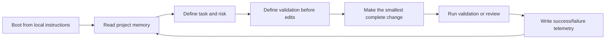

# Agent HQ OS

**AI agents forget. Projects should not.**

Agent HQ OS is a small, file-based operating layer for AI-assisted work: boot from memory, define validation before editing, delegate only when roles are clear, and write down what the project learned.

It came from a practical annoyance: long AI sessions were useful, but the next session would forget the important part. A bug that had already been diagnosed came back. A workflow guard looked unnecessary because the reason lived in a chat transcript. A "quick" patch skipped the validation command that would have caught the real problem.

This repo is the answer to that pattern. Not a platform. Not a prompt pack. A repo-local way to make AI-assisted work less forgetful.

## The Pain It Addresses

A normal AI workflow usually works like this:

1. Paste context into ChatGPT, Claude, Codex, Claude Code, or an IDE agent.
2. Get a useful answer or patch.
3. Fix the follow-up issue.
4. Move on.
5. Repeat the same explanation next time because the useful context never became project memory.

That is manageable for one-off questions. It breaks down when work spans multiple days, multiple tools, workflow exports, credentials, approval gates, and production-adjacent automation.

## What Agent HQ OS Adds

| Recurring problem | Repo-local countermeasure |
| --- | --- |
| The agent forgets prior failures | `memory/KNOWN_FAILURES.md` |
| A good approach gets rediscovered instead of reused | `memory/VALIDATED_PATTERNS.md` |
| Nobody remembers why a patch was made | `memory/PATCH_HISTORY.md` and decision logs |
| Validation happens after the model is already confident | validation-first task templates |
| Multi-agent work creates noise | HQ orchestration with explicit outputs |
| The next session starts cold | `SESSION_BOOT.md` |

## The Core Loop



## A Small Example

Instead of starting a session with:

```text
Please fix the workflow bug.
```

Start with:

```text
Read AGENTS.md, SESSION_BOOT.md, KNOWN_FAILURES.md, VALIDATED_PATTERNS.md, and PATCH_HISTORY.md first. State the validation plan before editing. Do not touch live publishing or credentials. Record telemetry after the fix.
```

The difference is not ceremony. It changes what the model treats as source of truth.

## What You Can Do in 5 Minutes

1. Copy `starter_kit/project_bootstrap/` into a project.
2. Fill in `PROJECT_BOOT.md` with the project purpose and validation commands.
3. Add one real failure to `memory/KNOWN_FAILURES.md`.
4. Start a session with `onboarding/QUICK_BOOT.md`.
5. Close the task by updating `telemetry/DAILY_EXECUTION_LOG.md`.

## Where This Helps

- A solo developer who uses several AI tools and keeps re-pasting context.
- A small team that wants agents to help without bypassing review.
- An automation project where publishing, messaging, or finance actions need approval gates.
- An OSS maintainer turning private prototypes into public repos without leaking private assumptions.

## Where It Does Not Help

- One-off questions where durable memory does not matter.
- Teams that will not maintain the memory files.
- Work that needs domain judgment but is being delegated to AI to avoid review.
- Fully autonomous execution. This repo is deliberately human-in-the-loop.

## Production-ready vs Experimental

Ready now: templates, starter kit, boot flow, role cards, demo scenarios, validation checklists, and telemetry structure.

Still experimental: tool-specific automation, hosted orchestration, CI enforcement, and any live integration.

## Start Here

- `onboarding/FIRST_5_MINUTES.md`
- `starter_kit/project_bootstrap/`
- `docs/migration_guide.md`
- `DESIGN_TRADEOFFS.md`
- `LESSONS_LEARNED.md`

## Safety Model

Agent HQ OS is local-first. It does not require real API keys, does not send messages, does not publish posts, and does not trade. Projects using it should explicitly mark external writes, publishing, messaging, trading, and infrastructure mutation as approval-gated.

## Contributing

The most useful contributions are not grand abstractions. Add a realistic failure story, improve a validation checklist, create a fixture, or make the starter kit easier to adopt in an existing repo.

## Runnable Demo

The repo includes a local-only demo workspace:

```bash
python setup_demo_workspace.py
```

Expected output:

```text
PASS: Agent HQ OS demo workspace initialized
```

The demo creates `demo_workspace/output/validation_first_note.md` and appends local telemetry. It does not call any external service.

## Screenshots


