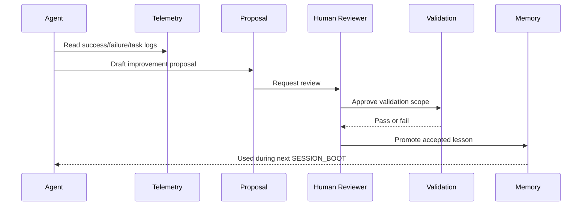

# Self-Improving Skill Loop

Agent HQ OS treats self-improvement as an operating discipline, not as a magical model capability.

The project can improve its own playbooks only when real execution evidence shows that a rule, checklist, validation step, or memory entry should change. The agent may draft the improvement, but the maintainer decides whether it becomes part of the project contract.

## What This Adds

- a reusable `skills/self_improving_skill/` package;
- a proposal template for telemetry-driven improvements;
- an explicit safety boundary around what agents may not change automatically;
- a path for turning repeated failures into `KNOWN_FAILURES`;
- a path for turning proven practices into `VALIDATED_PATTERNS`.

## Improvement Flow

## What Counts as Evidence

Good evidence:

- a repeated failure in `FAILURE_TELEMETRY`;
- a validation command that caught a real issue;
- a reviewer finding that would likely recur;
- an onboarding step that caused confusion;
- a successful fix that should become a standard pattern.

Weak evidence:

- a single vague preference;
- speculation about future scale;
- a broad claim that something "feels better";
- a proposed automation without validation;
- an improvement that requires secrets or live production access.

## Human Review Boundary

The proposal must remain pending when it touches:

- credentials;
- production infrastructure;
- social posting;
- live workflow activation;
- trading or finance execution;
- destructive Git or filesystem behavior;
- private execution logs;
- account identifiers or private URLs.

## Promotion Rules

Promote to `KNOWN_FAILURES` when:

- the issue is repeatable;
- the prevention step is concrete;
- the memory entry helps a future agent avoid the same mistake.

Promote to `VALIDATED_PATTERNS` when:

- the pattern worked at least once under validation;
- the limits are stated clearly;
- it does not imply production readiness beyond the evidence.

Promote to `PATCH_HISTORY` when:

- a real file change was made;
- the validation result is known;
- follow-up work is explicit.

## Why This Matters

Most AI project workflows lose operational learning in chat history. Agent HQ OS keeps that learning close to the repo. The Self-Improving Skill gives maintainers a safe way to let the workflow improve without pretending that an agent should be trusted to rewrite its own rules unchecked.
