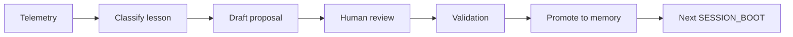

# Self-Improving Skill

The Self-Improving Skill is a review-gated loop for improving Agent HQ OS operating playbooks from real execution telemetry.

It is deliberately conservative. It does not let an agent rewrite project behavior on its own, change credentials, publish content, deploy infrastructure, or turn a failed run into an automatic production change. It turns repeated evidence into a proposal that a maintainer can review, validate, and accept.

## Why It Exists

Long AI-assisted projects usually develop the same problems repeatedly:

- a failure is fixed once but never added to memory;
- the next session repeats an already-known bad path;
- a successful workaround remains hidden in chat history;
- retry rules stay vague;
- "self-improvement" becomes an unsafe claim instead of a reviewable process.

This skill makes improvement explicit and boring: read telemetry, classify the lesson, propose a patch, validate it, and only then promote it into project memory.

## Inputs

- `telemetry/DAILY_EXECUTION_LOG.md`
- `telemetry/SUCCESS_TELEMETRY.md`
- `telemetry/FAILURE_TELEMETRY.md`
- `memory/KNOWN_FAILURES.md`
- `memory/VALIDATED_PATTERNS.md`
- `memory/PATCH_HISTORY.md`
- task-specific validation output

## Outputs

- a `SKILL_IMPROVEMENT_PROPOSAL`;
- optional additions to `KNOWN_FAILURES`;
- optional additions to `VALIDATED_PATTERNS`;
- optional updates to `PATCH_HISTORY`;
- a validation plan that must pass before the proposal is accepted.

## Acceptance Boundary

A proposal can be accepted only when:

1. the failure or pattern is backed by evidence;
2. the proposed change is scoped to local project behavior;
3. no credentials, private URLs, account IDs, production logs, or tokens are copied into memory;
4. validation steps are listed and runnable;
5. a human maintainer approves the change.

## Non-Goals

- no automatic credential handling;
- no autonomous production deployment;
- no live social posting;
- no live trading;
- no hidden remote state;
- no claim that the system "learns" without review.

## Minimal Loop

The result is a safer form of self-improvement: the project gets better because its operating memory gets better.
