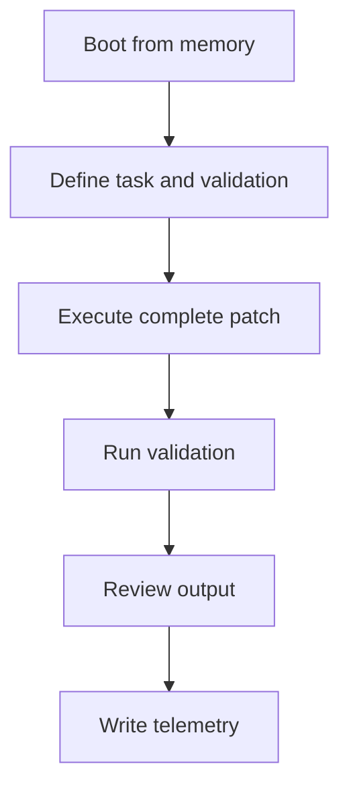

# Standard Execution Loop

```mermaid
flowchart TD
  Boot[Boot from memory] --> Plan[Define task and validation]
  Plan --> Execute[Execute complete patch]
  Execute --> Validate[Run validation]
  Validate --> Review[Review output]
  Review --> Telemetry[Write telemetry]
```

